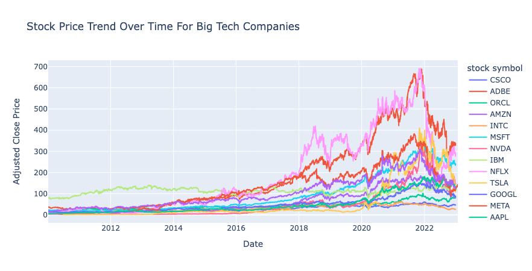
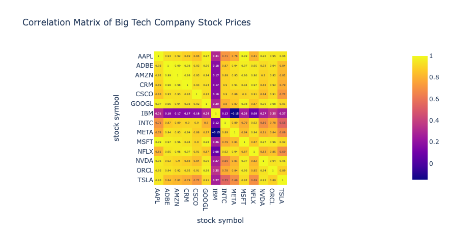
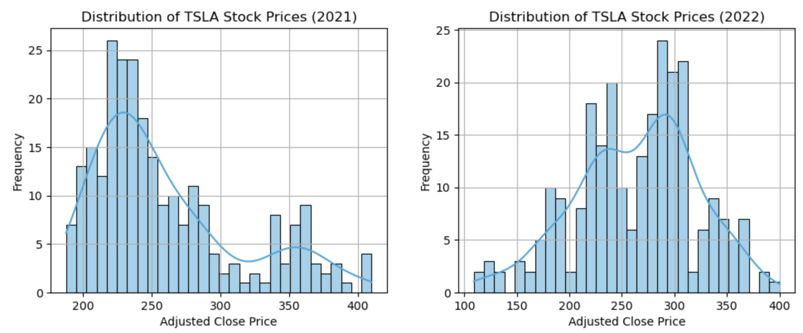
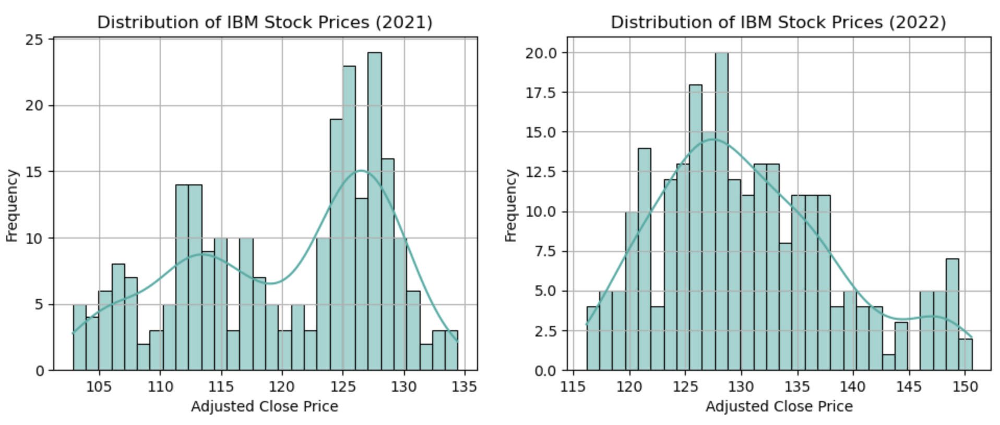
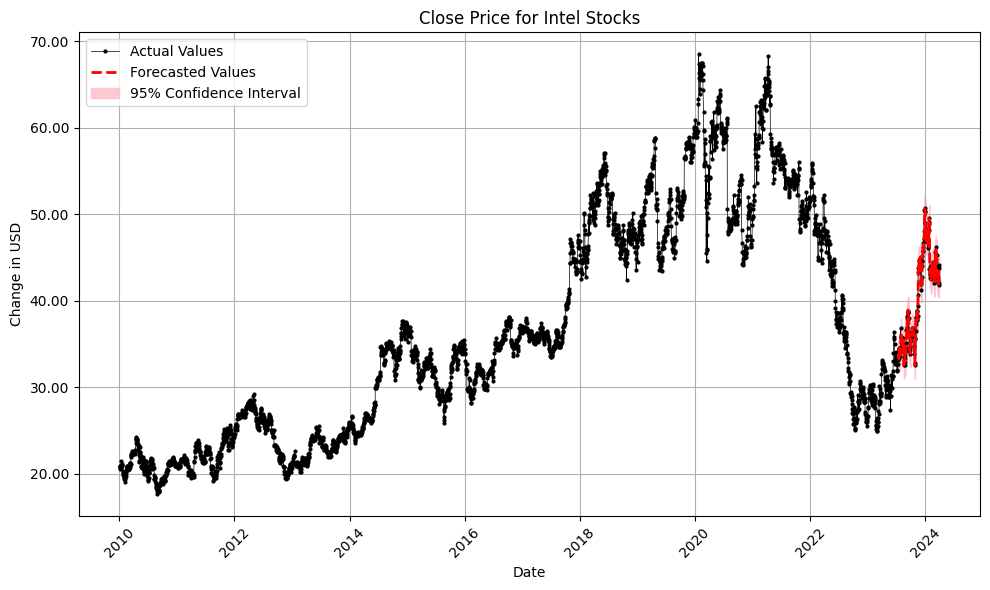

# Exploratory Data Analysis: Big Tech Stocks
I've recently developed an interest in the world of finance. On a whim, I decided to find whatever data I could and see what insights and narratives I could get out of it. 

# Data Collection
Yahoo Finance has a large database of historical stock information for a lot of companies so I downloaded the csv files for the big tech companies and concatenated them into one big dataframe ('big_tech_stoc_prices.csv'). The list of files for each company can be found in the 'data' folder. 

I also created a dictionary table with all the company stock symbols and their actual names just because. It was useful for me being new to the field but most of them are easy to decipher anyways.

# Analysis
The analysis can be found in the 'eda.ipynb' jupyter notebook. Most of the graphs were created with plotly so they are interactive. 
Unfortunately GitHub does not render plotly graphs interactively so you will have to download the notebooks for that.

TLDR of the analysis: 
*2022 was a historically bad year for big tech companies*
#
I'm currently doing some research as to why to hopefully update this repo with a much more detailed analysis so stay tuned!

# Forecasting

I fit an ARIMA forecasting model to the past 20+ years of daily Intel close prices. The `Auto ARIMA` function found a (3, 1, 2) model, meaning that the close price for intel stocks were highly correlated with the lagged value 3 days priot and the price shocks from 2 days prior. This manifested into a model that had a test RMSE of 0.99, meaning that the model averaged a 0.99 USD error from the observed close prices. The code can be found in the 'intel_forecast.ipynb' jupyter nobebook.

A similar forecast for tesla:
! [tesla predictions](tsla_forecast.png)
